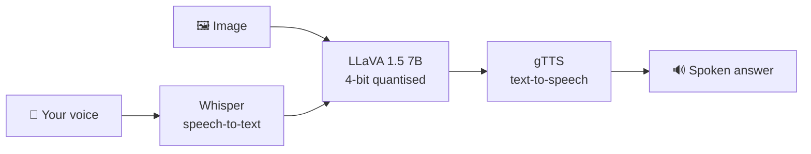

<div align="center">

# 🎙️👁️ VoiceLLAVA - Talk to an Image

**A multimodal voice assistant: show it a picture, ask a question out loud, and hear the answer.**


</div>

---

## ✨ How it works



1. **Whisper (`medium`)** transcribes the spoken question.
2. **LLaVA-1.5-7B** (`llava-hf/llava-1.5-7b-hf`, loaded in 4-bit with `bitsandbytes`) answers it about the uploaded image through the `image-to-text` pipeline.
3. **gTTS** converts the answer to speech.
4. A **Gradio** interface wires it all together (audio in, image in, text + audio out).

> 💡 Response time depends on the GPU and, for downloads, on your internet speed.

[](https://colab.research.google.com/github/Arashomranpour/VoiceLLAVA/blob/main/Voice_Assistant.ipynb)

## 🚀 Getting Started

Run it in **Google Colab with a GPU** (recommended), or locally with a CUDA GPU:

```bash
git clone https://github.com/Arashomranpour/VoiceLLAVA.git
cd VoiceLLAVA
pip install -r requirements.txt
jupyter notebook Voice_Assistant.ipynb
```

## 📁 Project Structure

```
.
├── Voice_Assistant.ipynb   # Whisper + LLaVA + gTTS + Gradio app
└── requirements.txt
```

## 🛠️ Tech Stack

`LLaVA` · `Whisper` · `gTTS` · `Gradio` · `Transformers` · `bitsandbytes` · `PyTorch`
